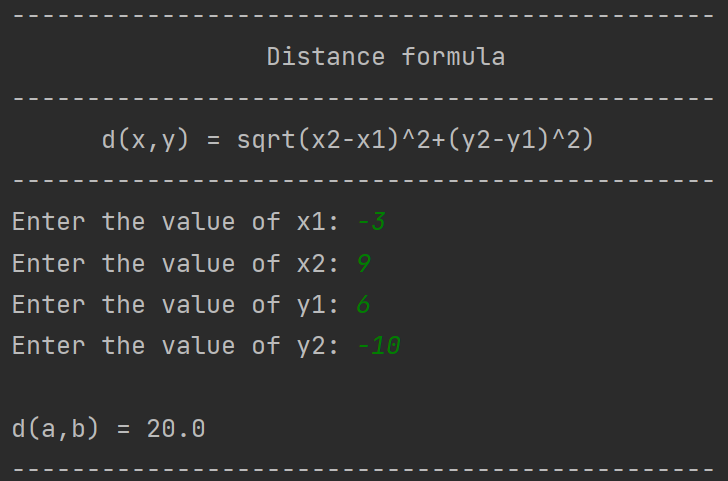
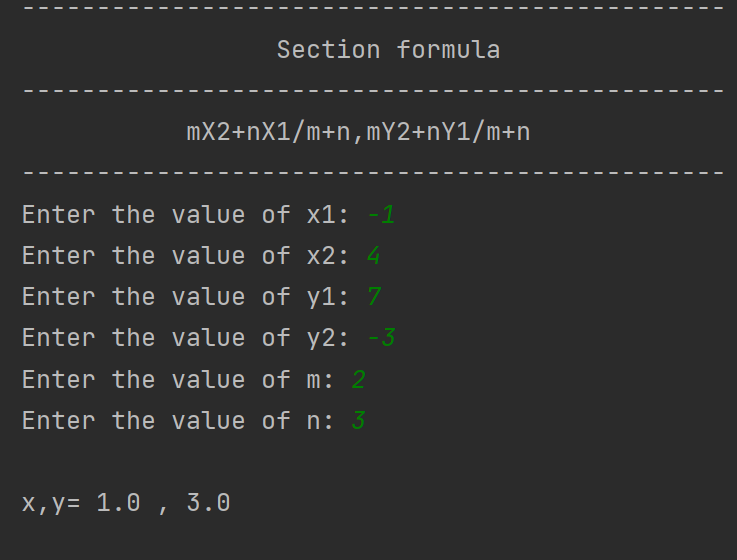
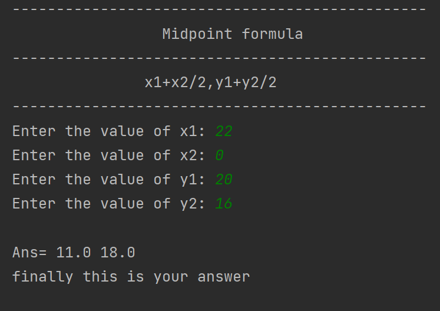
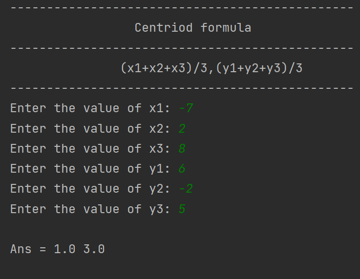

# Co-ordinate geometry examples

In classical mathematics, analytic geometry, also known as coordinate geometry or Cartesian geometry, is the study of geometry using a coordinate system. This contrasts with synthetic geometry.

Analytic geometry is used in physics and engineering, and also in aviation, rocketry, space science, and spaceflight. It is the foundation of most modern fields of geometry, including algebraic, differential, discrete and computational geometry. [More info...](https://en.wikipedia.org/wiki/Analytic_geometry)

1. [Distance formula](https://en.wikipedia.org/wiki/Distance)
   
   d(x,y) = sqrt(x2-x1)^2+(y2-y1)^2)
   
   Output:
   
   
1. [Section formula](https://en.wikipedia.org/wiki/Section_formula)
   
   mX2+nX1/m+n,mY2+nY1/m+n
   
   output:
   
   
1. [Midpoint formula](https://en.wikipedia.org/wiki/Midpoint)
   
   x1+x2/2,y1+y2/2
   
   output:
   
   
1. [Centroid formula](en.wikipedia.org/wiki/Centroid)

   (x1+x2+x3)/3,(y1+y2+y3)/3

   output:
   
   

